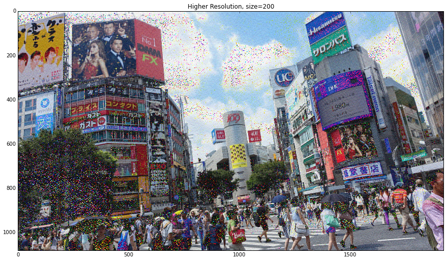

UECM3033 Assignment #2 Report
========================================================

- Prepared by: **LEM WEI HAO**
- Tutorial Group: T2

--------------------------------------------------------

## Task 1 --  $LU$ Factorization or SOR method

The reports, codes and supporting documents are to be uploaded to Github at: 

[https://github.com/weihaolem/UECM3033_assign2](https://github.com/weihaolem/UECM3033_assign2)

Explain your selection criteria here.

**The criteria I selected to choose the factorization methods is using Spectral Radius Theorem and Convergence Theorem to determine the applicable of Successive Over-relaxation (SOR) method. From Spectral Radius Theorem, in order that the sequence generated by $$x^{k+1}=(Kx^{k}+c)$$ to converge, regardless initial point $$x^{0}$$ , the necessary and sufficient condition is that spectral radius, $$\rho(K) < 1$$. Therefore, it claims that if $$\rho(K) < 1$$ , then optimal relaxation parameter, $$\omega$$ can be define using formula, $$\omega = \frac{2}{1+\sqrt{1-\rho_{jacobi}^{2}}} $$. Then SOR method converges for any $$x^{0}$$ with $$0 < \omega < 2$$ . if $$\rho(K) > 1$$ , we will consider LU factorization to solve the linear system since the SOR method will lead to divergence result.**

Explain how you implement your `task1.py` here.

**We are given 2 linear system (Ax = b) to solve by using two methods which LU factorisation and SOR method. With understand of two methods, we are create criteria to responded the scenario encountered and choose preferable method to solve the linear system. To solve linear system with LU factorization, first we are decomposite matrix A, and use new matrix A to find the solution of linear system, Ax=b. To linear system with SOR method, first we need to obtain D, L, U matrices from A. After then, using Jacobi method to obtain the matrix Mj. From Mj, we calculate the eigenvalues of Mj and obtain the spectral radius $$\rho$$ . $$\omega$$ obtained by using formula, $$\omega = \frac{2}{1+\sqrt{1-\rho_{jacobi}^{2}}} $$. Finally, using while loop, and SOR method formula, $$x^{(k+1)}=Q^{-1}(Q-A)x^{(k)}+Q^{-1}b$$ until we obtained the solution for linear system.**

---------------------------------------------------------

## Task 2 -- SVD method and image compression

picture file used. (image.JPG)

How many non zero element in $\Sigma$?
**1081 for each $\Sigma$ of r, g, b respectively**

Put here your lower and better resolution pictures. Explain how you generate
these pictures from `task2.py`.

**We control the resolution by changed number of non-zero elements of $\Sigma$ into 0. When $\Sigma$ have 30 non-zero elements, the resolution is lower compare to the original $\Sigma$ = 1081. When non-zero elements in $\Sigma$ increased to 200, the resolution of image is much better than 30 non-zero elements.**

What is a sparse matrix?

**In numerical analysis, a sparse matrix is a matrix in which most of the elements are zero. By contrast, if most of the elements are nonzero, then the matrix is considered dense. The fraction of non-zero elements over the total number of elements (i.e., that can fit into the matrix, say a matrix of dimension of m x n can accommodate m x n total number of elements) in a matrix is called the sparsity(density).**

**Sparse matrices are used to reduce the storage requirement of the image. This will make the algorithm run faster without lossing much of information.**

-----------------------------------

last modified: 11 March 2016
